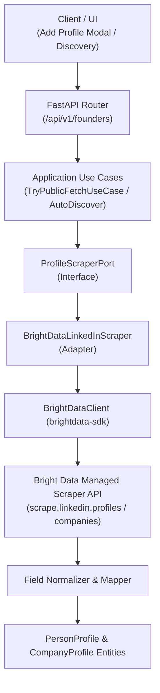

# LinkedIn Data Extraction & Bright Data API Integration

This document outlines the architecture, configuration, data extraction schema, and verification workflows for the **LinkedIn Data Extraction** engine using the **Bright Data LinkedIn Scraper API**.

---

## 1. Overview

The platform extracts public LinkedIn person and company profiles to power the **Founder Profiles** and **Automated Company Discovery** features. 

The integration relies exclusively on **Bright Data's Managed LinkedIn Scraper API** (`brightdata-sdk`), removing third-party dependencies such as Apify. Bright Data handles proxy rotation, anti-bot bypass, and structured schema delivery.

### Key Capabilities
- **Person Profile Extraction**: Full career experience timeline, education history (degrees, fields of study, institutions, years), skills, certifications, bio/about, location, headline, follower/connection counts, and avatar images.
- **Company Profile Extraction**: Company description, website, headquarters location, industry, founded year, employee count, and logo.
- **Bot Detection & Diagnostic Telemetry**: Every extraction records structured diagnostics (`outcome`, `bytes_fetched`, `fields_extracted`, `error_details`) for auditing and reliability.
- **Clean Architecture Adherence**: Pluggable `ProfileScraperPort` interface implemented by `BrightDataLinkedInScraper`.

---

## 2. Architecture & Components



### Core Files

| File | Purpose |
|---|---|
| [`backend/app/infrastructure/discovery/scrapers/brightdata_linkedin.py`](file:///F:/dev/Vset/backend/app/infrastructure/discovery/scrapers/brightdata_linkedin.py) | Adapter implementing `ProfileScraperPort` via `BrightDataClient`. |
| [`backend/app/application/ports/profile_scraper_port.py`](file:///F:/dev/Vset/backend/app/application/ports/profile_scraper_port.py) | Port interface declaring `fetch_person` and `fetch_company`. |
| [`backend/app/application/use_cases/try_public_fetch.py`](file:///F:/dev/Vset/backend/app/application/use_cases/try_public_fetch.py) | Validates, fetches, and parses founder profiles with diagnostic status. |
| [`backend/app/application/use_cases/auto_discover_founder.py`](file:///F:/dev/Vset/backend/app/application/use_cases/auto_discover_founder.py) | Automated multi-step founder discovery across web and LinkedIn. |
| [`backend/app/presentation/dependencies.py`](file:///F:/dev/Vset/backend/app/presentation/dependencies.py) | Dependency injection container providing `BrightDataLinkedInScraper`. |
| [`scripts/test_brightdata_live.py`](file:///F:/dev/Vset/scripts/test_brightdata_live.py) | Standalone verification script for live extraction and diagnostic logging. |

---

## 3. Configuration & Environment Variables

Configure your Bright Data API token in `.env`:

```bash
# Bright Data API Token (or BRIGHTDATA_API_KEY)
BRIGHTDATA_API_TOKEN=your_bright_data_api_token_here
```

### Configuration Validation
The application automatically resolves tokens via [`backend/app/config.py`](file:///F:/dev/Vset/backend/app/config.py):
- Supports aliases: `BRIGHTDATA_API_TOKEN`, `BRIGHTDATA_API_KEY`, `BRIGHT_DATA_API_KEY`, or `BRIGHTDATA_TOKEN`.
- Strips trailing/leading whitespace.
- If no token is provided, extraction fails gracefully with diagnostic outcome `token_missing`.

---

## 4. Extracted Data Schema

### 4.1 Person Profiles (`PersonProfile`)
Bright Data profile JSON is normalized into strongly typed domain objects:

| Field | Source from Bright Data API | Description |
|---|---|---|
| `name` | `name` or `first_name` + `last_name` | Full name of the individual |
| `headline` | `headline`, `position`, `title`, or `current_company.title` | Professional headline |
| `summary` | `about`, `summary`, or `description` | Self-authored biography |
| `location` | `location`, or `city` + `country` | Geographic location |
| `experience` | `experience` or `work_experience` | List of career roles (title, company, start, end, duration, description, is_current) |
| `education` | `education` or `educations_details` | Academic history (school, degree, field of study, start_year, end_year) |
| `skills` | `skills` or `top_skills` | Professional skills list |
| `certifications` | `certifications` or `licenses_and_certifications` | Licenses and certifications with authority |
| `languages` | `languages` | Spoken languages and proficiency |
| `follower_count` | `followers` or `followers_count` | Number of followers |
| `connection_count` | `connections` or `connections_count` | Number of connections |
| `avatar_url` | `avatar`, `profile_image`, or `photo` | Public avatar image URL |
| `url` | `url`, `link`, or input URL | Canonical profile URL |

### 4.2 Company Profiles (`CompanyProfile`)

| Field | Source from Bright Data API | Description |
|---|---|---|
| `name` | `name` | Organization name |
| `description` | `about` or `description` | Company overview |
| `website` | `website` or `link` | Official company domain |
| `headquarters` | `headquarters` or `city` | Corporate headquarters |
| `industry` | `industry` | Industry sector |
| `company_size` | `company_size` or `employees_in_linkedin` | Employee count bracket |
| `founded_year` | `founded` or `founded_year` | Year of founding |
| `logo_url` | `logo` or `logo_url` | Organization logo URL |

---

## 5. Diagnostic Telemetry & Outcomes

Every scrape call returns a `SourceDiagnostic` containing:
- `outcome`:
  - `ok`: Profile successfully fetched and fields extracted.
  - `token_missing`: Scraper called without an API key configured.
  - `not_found`: Profile does not exist or was deleted on LinkedIn.
  - `brightdata_error`: Bright Data API error, timeout, or network exception.
  - `empty_text`: Page loaded but contained no readable profile fields.
- `bytes_fetched`: Total payload byte size.
- `fields_extracted`: Array of successfully mapped fields (e.g. `['name', 'headline', 'experience', 'education']`).
- `error_details`: Specific error message or stack trace if a failure occurred.

---

## 6. How to Test & Verify

### 6.1 Run the Live Integration Test
A live verification script is provided to test real scraping directly against Bright Data:

```powershell
# From project root
backend\.venv\Scripts\python.exe scripts\test_brightdata_live.py
```

#### Sample Output:
```text
============================================================
BRIGHT DATA API INTEGRATION TEST
============================================================
Token Configured: True (Prefix: 4409ccff...)

[1/3] Testing Person Profile Scraping: https://www.linkedin.com/in/satyanadella
  Diagnostic Outcome : ok
  Bytes Fetched      : 27,200
  Fields Extracted   : ['name', 'headline', 'summary', 'location', 'experience', 'education']
  Name               : Satya Nadella
  Headline           : Chairman and CEO at Microsoft
  Location           : Redmond
  Experience Count   : 5
    1. Chairman and CEO at Microsoft (Feb 2014 - Present)
    2. Member Board Of Trustees at University of Chicago (2018 - Present)
    3. Board Member at Starbucks (2017 - 2024)
  Education Count    : 3
    1. The University of Chicago Booth School of Business (1994 - 1996)
    2. Manipal Institute of Technology, Manipal - Bachelor's Degree
    3. University of Wisconsin-Milwaukee - Master's Degree

[2/3] Testing Company Profile Scraping: https://www.linkedin.com/company/microsoft
  Diagnostic Outcome : ok
  Bytes Fetched      : 54,618
  Fields Extracted   : ['name', 'description', 'headquarters', 'website']
  Name               : Microsoft
  Website            : https://news.microsoft.com/
  Headquarters       : Redmond, Washington

[3/3] Testing TryPublicFetchUseCase Integration
  Success / Verified : False
  Diagnostic Status  : ok
  Message            : Candidate profile fetched but requires confirmation.
  Candidate Slug     : satya-nadella-microsoft
  Identity Status    : likely_match
  Founder Name       : Satya Nadella
  Timeline Entries   : 5
  Education Entries  : 3

============================================================
ALL BRIGHT DATA TESTS PASSED SUCCESSFULLY!
============================================================
```

### 6.2 Run Automated Unit & Integration Tests

```powershell
# Run backend scraper unit tests
backend\.venv\Scripts\pytest backend\tests\unit\test_brightdata_linkedin.py

# Run all backend tests
backend\.venv\Scripts\pytest backend\tests
```

### 6.3 Generate Executive PDF Dossiers

A batch extraction and publication-grade PDF renderer is available:

```powershell
# Run extraction and PDF generation
backend\.venv\Scripts\python.exe scripts\extract_and_generate_pdfs.py
```

Generated PDFs are saved in `output/profiles/`:
- `Satya_Nadella_Founder_Profile.pdf`: Executive brief covering 5 roles (Microsoft CEO, Univ of Chicago Trustee, Starbucks Board, Business Council, Fred Hutch) and 3 universities.
- `Reid_Hoffman_Founder_Profile.pdf`: 7-page dossier containing 13 career roles, 6 academic institutions, 9 honors & awards, 6 authored publications, and 14 board/community leadership positions.
- `Sundar_Pichai_Founder_Profile.pdf`: Complete executive profile unpacking nested Google roles (CEO + Product Leadership) across 22 years, plus 3 degrees (Wharton MBA, Stanford MS, IIT Kharagpur B.Tech).
- `Andrew_Ng_Founder_Profile.pdf`: Multi-page dossier detailing 8 founder/executive roles (Coursera, DeepLearning.AI, AI Fund, LandingAI, Google Brain, Baidu, Stanford) and 3 degrees (UC Berkeley PhD, MIT, CMU).

