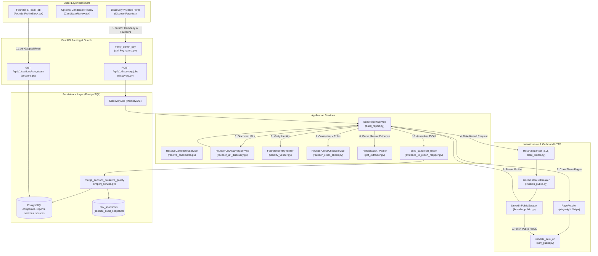
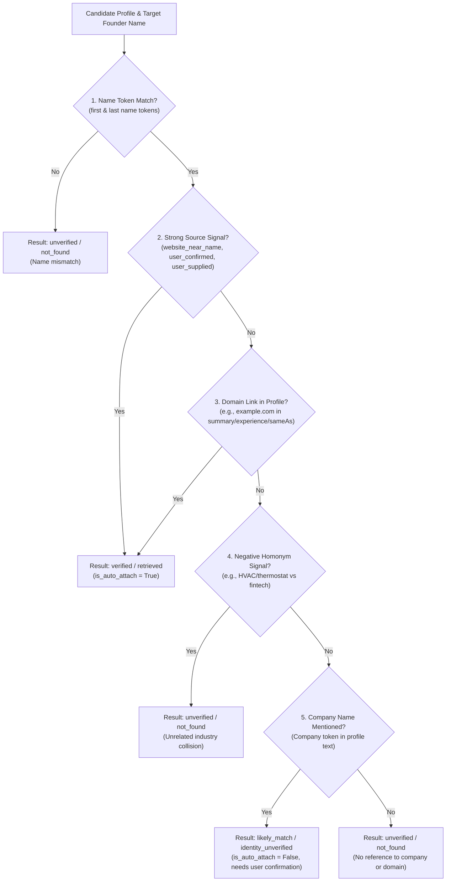
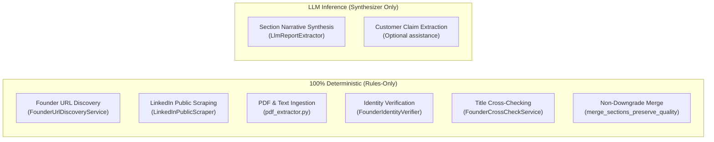

# Founder LinkedIn Profile Extraction Architecture

This document describes the technical implementation, security controls, privacy guarantees, and operational procedures for founder LinkedIn profile extraction in the vSET platform. It is written for engineers and technical reviewers operating and evaluating this system in production.

---

## 1. Purpose and scope

The primary objective of founder extraction in vSET is to establish a verified professional background for startup founding teams during pre-investment screening. The system extracts career timelines, education history, and current roles to assist investment committees in assessing founder-market fit.

### Scope
- **Automated URL Discovery**: Identification of candidate LinkedIn profile URLs via crawled company website pages (`/team`, `/about`), in-page anchor links, and public search engine snippets.
- **Polite Public Extraction**: Unauthenticated extraction of Schema.org JSON-LD and OpenGraph metadata from public LinkedIn pages without credential replay or session hijacking.
- **Identity Verification & Anti-Collision**: Deterministic verification requiring domain links or website proximity before profile data can be auto-attached to a company report.
- **Manual Evidence Ingestion**: Ingestion and structured parsing of user-supplied profile text and LinkedIn "Save to PDF" exports.
- **Semantic Cross-Checking**: Automated comparison between company-stated roles and LinkedIn current positions to highlight discrepancies.
- **Quality-Preserving Merging**: Non-downgrade merge logic ensuring high-quality evidence is never overwritten by subsequent bot-blocked runs.
- **Air-Gapped View Path**: Complete isolation between report viewing and network scraping ("scrape once, serve forever").

### Out of Scope & Explicit Non-Goals
- **Zero Authentication / No Bypass**: The system never stores LinkedIn user credentials, session cookies, or authorization tokens, and it does not bypass LinkedIn login challenges, CAPTCHAs, or Cloudflare Turnstile barriers.
- **No Headless Browser Automation**: Network scraping runs via lightweight, standard HTTP requests (`httpx`), adhering to strict memory and CPU budgets.
- **No Live Scraping on Report Views**: Report presentation endpoints strictly query PostgreSQL; no external requests are permitted on the view path.

---

## 2. End-to-end flow

The following diagram illustrates the complete data lifecycle—from discovery initiation to database persistence and frontend presentation:



### Numbered Walkthrough

1. **Request Initiation**: An operator submits a company name and founder list via `frontend/src/features/discovery/ui/DiscoverPage.tsx` or the REST API `backend/app/presentation/routers/discovery.py::start_discovery_job`. All write endpoints enforce admin authorization via `backend/app/presentation/guards/api_key_guard.py::verify_admin_key`.
2. **Candidate URL Resolution**: `backend/app/application/services/resolve_candidates.py::ResolveCandidatesService.execute` queries configured search engines to identify candidate LinkedIn URLs for the company and founders, scoring candidate confidence.
3. **Background Job Orchestration**: `backend/app/application/services/build_report.py::BuildReportService.execute` takes ownership of the discovery job in the background, updating progress transitions through `JobState.RUNNING`.
4. **Website Crawling & Proximity URL Discovery**: `BuildReportService` first crawls the official corporate website. `backend/app/application/services/founder_url_discovery.py::FounderUrlDiscoveryService._find_url_on_website_pages` inspects team pages (`/about`, `/team`, `/leadership`), extracting social anchor links located adjacent to founder name mentions.
5. **Search Discovery Fallback**: If no website link is found, `FounderUrlDiscoveryService._find_url_in_search` extracts public profile URLs from cached search snippets matching `https?://(?:www\.)?linkedin\.com/in/[\w-]+`.
6. **Rate-Limited Public Scraping**: Requests pass through `backend/app/infrastructure/discovery/http/rate_limiter.py::HostRateLimiter.wait` (enforcing a 3.0-second delay per host) and `backend/app/infrastructure/discovery/scrapers/linkedin_public.py::LinkedInCircuitBreaker.is_open`. `LinkedInPublicScraper._fetch_html` issues an unauthenticated GET request with browser headers.
7. **Identity Verification**: Scraped profile data is passed to `backend/app/application/services/identity_verifier.py::FounderIdentityVerifier.verify`. If the profile does not explicitly link the company domain or originate from a confirmed source, it is marked `identity_unverified` with status `likely_match` and barred from automatic attachment.
8. **Manual Evidence Processing**: If the user uploaded a PDF or pasted text, `backend/app/application/services/build_report.py::BuildReportService._apply_manual_evidence` invokes `backend/app/application/services/pdf_extractor.py::parse_manual_profile_text`, sanitizes text, strips PII, and generates a structured `PersonProfile`.
9. **Role Cross-Checking**: For verified profiles, `backend/app/application/services/founder_cross_check.py::FounderCrossCheckService.cross_check_founder_role` compares the role stated on the company website against the current role listed on LinkedIn, emitting a `CrossCheckConflict` if core titles diverge.
10. **Canonical Assembly & Non-Downgrade Import**: `backend/app/application/mappers/evidence_to_report_mapper.py::build_canonical_report` generates the report section payload. `backend/app/infrastructure/ingestion/import_service.py::merge_sections_preserve_quality` compares new founder profiles against existing database records using `STATUS_RANK`, ensuring verified data is never replaced by bot blocks.
11. **Air-Gapped UI Rendering**: When an operator navigates to the report, `frontend/src/features/report/ui/blocks/FounderProfileBlock.tsx` renders the profile from database cache via `GET /api/v1/sections/{slug}/team`. Zero outbound network calls are made.

---

## 3. Components and responsibilities

The table below outlines every component responsible for founder profile discovery, parsing, verification, and persistence:

| File | Class / Function | One-Sentence Responsibility | Port Implemented (if any) |
| :--- | :--- | :--- | :--- |
| `backend/app/application/services/founder_url_discovery.py` | `FounderUrlDiscoveryService` | Discovers founder profile URLs across three priority tiers (user confirmed, website team page, search fallback). | None |
| `backend/app/application/services/identity_verifier.py` | `FounderIdentityVerifier` | Verifies whether a candidate profile authentically belongs to the founder using domain links and negative homonym checks. | None |
| `backend/app/application/services/founder_cross_check.py` | `FounderCrossCheckService` | Performs semantic title normalization and compares company website roles against LinkedIn current positions. | None |
| `backend/app/infrastructure/discovery/scrapers/linkedin_public.py` | `LinkedInPublicScraper` | Fetches unauthenticated public LinkedIn HTML and extracts Schema.org JSON-LD and OpenGraph tags. | `ProfileScraperPort` |
| `backend/app/infrastructure/discovery/scrapers/linkedin_public.py` | `LinkedInCircuitBreaker` | Halts outbound LinkedIn traffic for 30 minutes after 3 consecutive bot blocks (HTTP 403/429/challenges). | None |
| `backend/app/infrastructure/discovery/scrapers/normalizer.py` | `clean_text`, `extract_year` | Sanitizes unicode strings, normalizes whitespace, and extracts four-digit calendar years. | None |
| `backend/app/infrastructure/discovery/http/ssrf_guard.py` | `validate_safe_url` | Blocks outbound requests targeting private networks, loopback addresses, cloud metadata endpoints, or forbidden data brokers. | None |
| `backend/app/infrastructure/discovery/http/rate_limiter.py` | `HostRateLimiter` | Enforces a minimum interval (default 3.0s) between consecutive HTTP requests to the same host. | None |
| `backend/app/application/services/pdf_extractor.py` | `extract_pdf_text` | Extracts plain text from PDF streams using pure Python `zlib` decompression within a 2 MB memory cap. | None |
| `backend/app/application/services/pdf_extractor.py` | `parse_manual_profile_text` | Parses pasted text or PDF exports into structured career timelines, education, skills, and certifications. | None |
| `backend/app/application/services/pdf_extractor.py` | `discard_contact_info` | Discards contact blocks, emails, phone numbers, and personal URLs to prevent PII retention. | None |
| `backend/app/application/services/resolve_candidates.py` | `ResolveCandidatesService` | Queries search providers to find initial candidate URLs for the company and founders before job launch. | None |
| `backend/app/application/services/start_discovery_job.py` | `StartDiscoveryJobService` | Validates discovery request inputs and queues background job execution in the job store. | None |
| `backend/app/application/services/build_report.py` | `BuildReportService` | Orchestrates end-to-end background discovery: website crawling, scraping, identity checks, and import. | None |
| `backend/app/application/mappers/evidence_to_report_mapper.py` | `build_canonical_report` | Maps raw evidence entities into canonical JSON report sections and founder profile blocks. | None |
| `backend/app/infrastructure/ingestion/import_service.py` | `ReportImportService` | Persists canonical reports into PostgreSQL, managing transaction boundaries and versioning. | `ReportImportPort` |
| `backend/app/infrastructure/ingestion/import_service.py` | `merge_sections_preserve_quality` | Enforces non-downgrade merge logic across report sections based on `STATUS_RANK`. | None |
| `backend/app/infrastructure/persistence/report_repo.py` | `SqlAlchemyReportRepository` | Provides SQLAlchemy persistence operations for screening reports and raw audit snapshots. | `ReportRepository` |
| `backend/app/infrastructure/persistence/report_repo.py` | `sanitize_audit_snapshot` | Recursively strips raw profile text, contact fields, emails, phones, and avatar URLs from audit snapshots. | None |
| `backend/app/presentation/routers/discovery.py` | Discovery Router | Exposes endpoints for resolving candidates, starting discovery jobs, and polling job status. | None |
| `backend/app/presentation/routers/companies.py` | Companies Router | Exposes read endpoints for companies and report headers, and the cascading DELETE endpoint. | None |
| `backend/app/presentation/guards/api_key_guard.py` | `verify_admin_key` | Protects administrative mutation endpoints against unauthorized calls using constant-time comparison. | None |
| `frontend/src/features/report/ui/blocks/FounderProfileBlock.tsx` | `FounderProfileBlock` | Renders founder profile cards, timeline visuals, cross-check warnings, and manual upload fallbacks. | None |
| `scripts/export_company.py` | `export_company` | Exports sanitized canonical JSON for a company from local development for production import. | None |

---

## 4. How a founder's profile URL is found

Candidate URL discovery follows three strict priority tiers implemented in `backend/app/application/services/founder_url_discovery.py::FounderUrlDiscoveryService.discover_url`:

### Priority 1: User-Confirmed / Explicitly Provided URL
- **Condition**: Checked in `confirmed_urls` under `founder_linkedin_{slug}` or exact founder name (`backend/app/application/services/founder_url_discovery.py::FounderUrlDiscoveryService.discover_url`).
- **Provenance**: `source_type = "user_confirmed"`.
- **Behavior**: If present and non-empty, this URL immediately bypasses automated search and crawling.

### Priority 2: Company Website Team/About Page Links
- **Condition**: Evaluated in `backend/app/application/services/founder_url_discovery.py::FounderUrlDiscoveryService._find_url_on_website_pages`.
- **Target Pages**: Crawled pages whose URLs contain `team`, `people`, `leadership`, `founder`, or `about`.
- **Extraction Rules**:
  1. **Social Links**: Evaluates `page.social_links` mapped during page fetching. If a key starts with `linkedin_person_` and the URL contains both the founder's first name and last name tokens, it is selected (`FounderUrlDiscoveryService._find_url_on_website_pages`).
  2. **In-Page Anchor Links**: Checks all hyperlinks (`page.links`) matching `linkedin.com/in/`. Matches require both first and last name parts to appear in the link URL.
  3. **Text Proximity Matching**: Scans page text for the founder's full name. If found, extracts a window (-100 to +200 characters) and searches for adjacent `linkedin.com/in/` links where the URL slug contains name tokens.
- **Provenance**: `source_type = "website_near_name"`, recording `source_page_url` and `supporting_quote`.

### Priority 3: Search Engine Candidate Fallback
- **Condition**: Evaluated in `backend/app/application/services/founder_url_discovery.py::FounderUrlDiscoveryService._find_url_in_search`.
- **Search Queries**: Constructed by `backend/app/application/services/resolve_candidates.py::ResolveCandidatesService.execute` as `"{founder_name} {company_name} LinkedIn"`.
- **Matching Pattern**: Regex `https?://(?:www\.)?linkedin\.com/in/[\w-]+` applied to candidate snippets (`founder_{slug}`, `founder_linkedin_{slug}`).
- **Provenance**: `source_type = "search_discovery"`.

If none of these tiers yield a valid candidate, `DiscoveredFounderUrl` returns `url=None` with `source_type="none"`.

---

## 5. What is fetched and parsed

When scraping a public LinkedIn profile, `backend/app/infrastructure/discovery/scrapers/linkedin_public.py::LinkedInPublicScraper` performs an unauthenticated HTTP GET request. It does not load JavaScript, run browser automation, or bypass login walls.

Parsing is performed in `backend/app/infrastructure/discovery/scrapers/linkedin_public.py::LinkedInPublicScraper.parse_person_html` by extracting:
1. **Schema.org JSON-LD**: `<script type="application/ld+json">` blocks containing an entity with `"@type": "Person"`.
2. **OpenGraph Meta Tags**: `<meta property="og:...">` tags.

### Field Extraction Matrix

| Field | Available from Logged-Out Public Page? | Code Source / Extraction Logic | Notes |
| :--- | :--- | :--- | :--- |
| **Full Name** | Yes | `person_data["name"]` or `og:title` | Strips trailing `" \| LinkedIn"`. |
| **Headline / Job Title** | Yes | `person_data["jobTitle"]` or `og:description` | Fallback to `clean_text`. |
| **Location** | Partially | `person_data["address"]` (`addressLocality`, `addressCountry`) | Often omitted in public JSON-LD. |
| **Summary / About** | Partially | `person_data["description"]` or `og:description` | May be truncated if behind authwall. |
| **Experience Timeline** | Limited | `person_data["worksFor"]` array | Contains company name and title; start/end dates are usually omitted in public Schema.org. |
| **Education History** | Limited | `person_data["alumniOf"]` array | Institution and degree; graduation year parsed via `extract_year`. |
| **Profile URL** | Yes | Canonical request URL | Normalized via `normalize_linkedin_url`. |
| **Avatar Photo URL** | Available but **Discarded** | `person_data["image"]` or `og:image` | Excluded from UI and database to prevent third-party tracking. |
| **Connections Count** | **No** | None | Not exposed in unauthenticated public markup. |
| **Follower Count** | **No** | None | Not exposed in unauthenticated public markup. |
| **Skills & Endorsements** | **No** | None | Excluded from public logged-out Schema.org. Available only via manual PDF upload. |
| **Certifications** | **No** | None | Excluded from public logged-out Schema.org. Available only via manual PDF upload. |
| **Contact Info (Email/Phone)**| **No** (and scrubbed) | `discard_contact_info` | Never extracted; explicitly purged if present. |

---

## 6. Identity verification

To prevent attaching profiles of individuals who share the founder's name but have no connection to the target company, all candidates pass through `backend/app/application/services/identity_verifier.py::FounderIdentityVerifier.verify`.

### Verification Decision Logic

The verification algorithm applies five deterministic checks in order:



### Verification Rules
1. **Name Matching (`FounderIdentityVerifier._names_match`)**: Strips honorifics (`Mr`, `Ms`, `Dr`) and non-alpha characters. Requires matching first and last name tokens when both names contain at least two parts.
2. **Strong Sources**: If `url_source_type` is `website_near_name`, `user_confirmed`, or `user_supplied`, the profile is immediately verified (`is_auto_attach=True`, `identity_status="verified"`, `retrieval_status="retrieved"`).
3. **Domain Corroboration**: If the company domain (e.g. `example.com`) appears anywhere in the candidate's summary, headline, experience list, or `sameAs` array, identity is verified (`is_auto_attach=True`).
4. **Negative Homonym Filter**: If the candidate text matches known unrelated industry patterns for entities sharing the same name (e.g., thermostat/climate hardware vs software), the candidate is rejected (`is_auto_attach=False`, `retrieval_status="not_found"`).
5. **Name + Company Mention Alone**: If the candidate text contains the company name token but lacks domain links or website corroboration, it is strictly flagged as `likely_match` with `retrieval_status="identity_unverified"` (`is_auto_attach=False`).

### User Presentation
- **Verified**: Displays full card with a sky blue chip (`LinkedIn public · retrieved <date>`).
- **Likely Match / Unverified**: Displays an amber warning card labeled `Needs confirmation`. The profile details are withheld from the report until an operator clicks `Confirm` or pastes verified evidence (`frontend/src/features/report/ui/blocks/FounderProfileBlock.tsx`).

### Open Questions
- *Homonym Rule Generalization*: The negative homonym check in `backend/app/application/services/identity_verifier.py::FounderIdentityVerifier.verify` currently checks specific negative keywords when company tokens collide. Extending this into a generalized ontology classifier would allow dynamic homonym rejection across any industry.

---

## 7. Retrieval statuses

The system represents extraction state using the `FounderRetrievalPayload.status` enum (`backend/app/domain/entities/discovery.py` and `frontend/src/features/report/ui/blocks/FounderProfileBlock.tsx`).

| Status Value | Backend Cause | UI Presentation | Operator Action Allowed |
| :--- | :--- | :--- | :--- |
| `retrieved` | Successfully fetched from public LinkedIn and passed identity verification. | Full-width card, sky blue badge (`LinkedIn public · retrieved <date>`). | View profile, open external LinkedIn link. |
| `user_provided` | Sourced from operator text paste or LinkedIn PDF export. | Full-width card, amber badge (`Provided by user (unverified) · <date>`). | Edit or replace via Discover wizard. |
| `reference_screen` | Imported from verified reference screen baseline. | Full-width card, emerald badge (`From vSET reference screen · <date>`). | Read-only reference baseline. |
| `identity_unverified` | Candidate found mentioning company name, but lacks domain link or website proximity. | Amber warning row labeled `Needs confirmation`. Experience/education withheld. | One-click `Confirm` button, or `Paste URL or profile text` link. |
| `blocked_by_bot_protection` / `blocked` | Encountered Cloudflare challenge, HTTP 403/429/999, or circuit breaker open. | Neutral compact row labeled `Not retrievable from this server`. Diagnostic logged. | `Open LinkedIn profile` (if URL known), `Provide manually` button. |
| `not_found` | Search found no profile, or candidate name failed matching rules. | Neutral card labeled `Public Profile Not Found`. Section note displayed. | `Provide founder details manually in Discovery` link. |
| `not_requested` | Founder name was not included in discovery parameters. | Profile block omitted from team section. | Add founder in discovery form. |

---

## 8. Manual evidence path

When public extraction is blocked by bot protection or yields incomplete data, operators provide manual evidence via the discovery wizard or candidate review panel.

### Upload Handling & Limits
- **File Types**: Plain text paste or LinkedIn "Save to PDF" exports (`backend/app/application/services/pdf_extractor.py`).
- **Memory & Size Caps**: PDFs are capped at 2 MB (`MAX_PDF_BYTES = 2 * 1024 * 1024`). Pasted text is capped at 50,000 characters (`MAX_TEXT_CHARS = 50000`).
- **Pure-Python Stream Decompression**: `backend/app/application/services/pdf_extractor.py::extract_pdf_text` parses PDF streams directly using standard library `zlib` decompression. It scans for literal text operators (`(text) Tj` and `[(t1)...] TJ`) and decodes octal escapes without invoking heavy external C libraries or OCR engines.

### Sanitization & PII Stripping
1. **Script & HTML Stripping (`sanitize_text`)**: Strips `<script>`, `<style>`, and HTML markup, unescaping standard entities.
2. **Contact Block Discard (`discard_contact_info`)**: Detects and purges the entire LinkedIn "Contact" block. Applies regex filters to eliminate personal emails, phone numbers, and direct contact URLs:
   ```python
   # backend/app/application/services/pdf_extractor.py::discard_contact_info
   email_re = re.compile(r"\b[a-zA-Z0-9_.+-]+@[a-zA-Z0-9-]+\.[a-zA-Z0-9-.]+\b")
   phone_re = re.compile(r"(?:\+\d{1,4}[-.\s]?)?\(?\d{2,4}\)?[-.\s]?\d{3,4}[-.\s]?\d{3,4}")
   ```
3. **Memory Cleanup**: In `backend/app/application/services/build_report.py::BuildReportService._apply_manual_evidence`, raw text and base64 PDF payloads are popped from the job state dictionary (`item.pop("text", None)`, `item.pop("pdf_base64", None)`) immediately after parsing, ensuring raw binary data is never persisted.

### Layout Parsing (`parse_manual_profile_text`)
The parser segments text into discrete sections: `header`, `skills`, `languages`, `certifications`, `summary`, `experience`, and `education`.
- **Experience Parsing**: Supports LinkedIn PDF three-line layout (Line 1: Company, Line 2: Title, Line 3: Dates), inline lines (`Title at Company (Dates)`), and web-pasted bullet formats.
- **Education Parsing**: Identifies degree, field of study, institution, and start/end graduation years.
- **Prompt Injection Defense**: Manual text is parsed strictly into structured domain dictionaries (`experience_timeline`, `education`, `skills`). It is never concatenated into raw LLM system prompts without schema validation.
- **Source Chip**: Profiles assembled via this path are permanently labeled `Provided by user (unverified)`.

---

## 9. Role of the LLM

vSET maintains a strict separation between deterministic rule-based operations and language model inference.

### Exact Division of Responsibilities



- **Founder Profiles Are Rules-Only**: URL discovery, profile scraping, JSON-LD parsing, manual PDF extraction, identity verification, and role cross-checks **never execute LLM inference**. Every field in a founder card originates directly from deterministic code.
- **LLM Usage**: Inference is reserved for unstructured company narrative synthesis in other report sections (e.g. executive summary, market opportunity) via `backend/app/infrastructure/discovery/llm/llm_report_extractor.py`.

### Model Configuration & Resilience
- **Configured Model**: `LLM_MODEL="qwen2.5:7b-instruct"` (defined in `backend/app/config.py::Settings.LLM_MODEL`). The 7B model provides high-fidelity synthesis over complex text compared to smaller variants.
- **Rules-First Fallback**: If Ollama or the local inference tunnel is offline, `backend/app/presentation/routers/discovery.py` logs a warning and proceeds. Discovery **never fails or blocks** due to LLM unavailability; it falls back to rules-only extraction, assembling canonical reports directly from deterministic parsers.

---

## 10. Cross-checks and merging

### Website vs LinkedIn Cross-Checks
`backend/app/application/services/founder_cross_check.py::FounderCrossCheckService` performs automated cross-checks between role titles found on the company website and the current role on LinkedIn.

1. **Title Normalization (`FounderCrossCheckService.normalize_title_tokens`)**:
   - Expands executive acronyms (`ceo` -> `chief executive officer`, `cto` -> `chief technology officer`, `coo` -> `chief operating officer`, `cpo` -> `chief product officer`, `cfo` -> `chief financial officer`).
   - Normalizes phrasing (`co-founder` -> `founder`, `&` -> `and`).
   - Strips separators and punctuation (`/`, `|`, `·`, `-`).
2. **Execution Precondition**: Comparing roles is permitted **only** when the LinkedIn profile lists a current position at the target company (`FounderCrossCheckService._is_position_at_company`). If no current position at the company exists on LinkedIn, no comparison is made.
3. **Discrepancy Reporting**: If both sources list distinct core leadership roles (e.g. Website states "Chief Technology Officer" while LinkedIn states "Chief Executive Officer"), a `CrossCheckConflict` is generated:
   - Field: `Title / Role`
   - Label: `Differences found - verify`
   - Severity: `low`
   - Details: `"Differences found - verify: Website states '{web}' while LinkedIn current position lists '{li}'."`

### Non-Downgrade Merge Rule
During report re-runs or refreshes, `backend/app/infrastructure/ingestion/import_service.py::merge_sections_preserve_quality` guards existing high-quality data against regression.

The service assigns numeric quality ranks:
```python
# backend/app/infrastructure/ingestion/import_service.py::STATUS_RANK
STATUS_RANK: dict[str, int] = {
    "retrieved": 4,
    "user_provided": 4,
    "reference_screen": 4,
    "identity_unverified": 2,
    "blocked_by_bot_protection": 1,
    "not_found": 0,
}
```

- **Protection Logic**: If an existing report contains a founder profile with rank 4 (`retrieved`, `user_provided`, or `reference_screen`), and a subsequent discovery run encounters bot protection (`blocked_by_bot_protection`, rank 1) or an unverified candidate (`identity_unverified`, rank 2), the service retains the existing profile block.
- **Omission Guard**: If an existing founder profile is omitted entirely from a subsequent run's parameters, `merge_sections_preserve_quality` re-inserts the existing block into the new `team` section.

---

## 11. Persistence and "scrape once, serve forever"

### Storage Schema
Data persists in PostgreSQL via SQLAlchemy models:
- `companies`: Company entity, slug, domain, creation timestamps.
- `reports`: Report metadata, final cryptographic fingerprint, schema version.
- `sections`: Report sections (`team`, `product`, etc.). Founder profiles are stored as structured JSON list blocks (`["founder_profile", title, payload]`) inside `sections.blocks`.
- `sources`: Provenance records for every URL, publisher, and timestamp.
- `raw_snapshots`: Sanitized audit copies of canonical reports scrubbed via `backend/app/infrastructure/persistence/report_repo.py::sanitize_audit_snapshot`.

### View-Path Isolation
Standard GET endpoints (`/api/v1/companies`, `/api/v1/companies/{slug}`, `/api/v1/sections/{slug}/{key}`) are strictly isolated from outbound networking:
- They execute simple database queries (`SELECT`).
- No scraper, crawler, or HTTP client is instantiated on the read path.
- This architectural constraint is formally verified by the automated test suite in `backend/tests/integration/test_view_paths_isolation.py`.

### Refresh Operations
- **Authorization**: Refreshing an existing report triggers discovery and is gated behind `verify_admin_key`, requiring `IMPORT_API_KEY`.
- **Execution**: Runs asynchronously in the background. The resulting canonical report passes through `merge_sections_preserve_quality` before database commitment.

---

## 12. Production behaviour on AWS Lightsail

### Datacenter IP Blocking
When deployed in a cloud datacenter (such as AWS Lightsail), outbound HTTP requests to LinkedIn are systematically challenged or rejected:
- **Block Mechanisms**: Cloudflare bot protection returns HTTP 403, HTTP 429, or HTTP 999 with Turnstile JavaScript challenges.
- **Circuit Breaker Activation**: Upon encountering 3 consecutive blocks, `backend/app/infrastructure/discovery/scrapers/linkedin_public.py::LinkedInCircuitBreaker` opens for 1,800 seconds (30 minutes). Further outbound calls to LinkedIn are skipped immediately with diagnostic `circuit_breaker_open`.
- **UI State**: The founder card renders a clean, neutral row:
  - Badge: `Not retrievable from this server` (rose styling).
  - Copy: `"Technical diagnostics recorded in Retrieval log."`
  - Action: A direct `Provide manually` button linking to the discovery wizard.

### Supported Production Workarounds
vSET explicitly rejects scraping bots, proxy rotation networks, and CAPTCHA solving farms. Two supported workflows exist for operating in production:

#### 1. In-App Manual Ingestion (Recommended)
An operator opens LinkedIn in their local authenticated browser, selects **More > Save to PDF** on the founder's profile, and uploads the PDF (or pastes the text) into the discovery wizard / candidate review panel. The backend parses this via `pdf_extractor.py`, applying full PII stripping.

#### 2. Local Extraction & Canonical Import
1. Run discovery locally on an authorized development workstation or office network:
   ```bash
   python scripts/export_company.py --slug example-corp --output example_canonical.json
   ```
2. The export script scrubs raw profile buffers and generates a sanitized canonical JSON file.
3. Import the file directly into the production Lightsail instance via the admin API:
   ```bash
   curl -X POST https://<INSTANCE_DOMAIN>/api/v1/reports/import \
     -H "X-API-Key: $IMPORT_API_KEY" \
     -H "Content-Type: application/json" \
     --data-binary @example_canonical.json
   ```

---

## 13. Privacy and security controls

The platform incorporates comprehensive privacy and security controls:

- **Zero Credential Usage**: No user accounts, credentials, or cookies are stored or transmitted.
- **No Image Hotlinking**: Avatars are rendered strictly as client-side SVG initials (`frontend/src/shared/ui/Avatar.tsx`). External profile images are never embedded or hotlinked, preventing user tracking by third parties.
- **Contact Info Elimination**: `backend/app/application/services/pdf_extractor.py::discard_contact_info` strips personal phone numbers, email addresses, and personal messaging URLs.
- **Audit Snapshot Scrubbing**: `backend/app/infrastructure/persistence/report_repo.py::sanitize_audit_snapshot` recursively scrubs raw text blobs, PDFs, photo URLs, phone numbers, and emails before saving audit snapshots to the database.
- **Server-Side Request Forgery (SSRF) Guard**: `backend/app/infrastructure/discovery/http/ssrf_guard.py::validate_safe_url` resolves DNS hostnames and rejects any IP falling within:
  - Private networks (RFC 1918: `10.0.0.0/8`, `172.16.0.0/12`, `192.168.0.0/16`)
  - Loopback addresses (`127.0.0.0/8`, `::1`)
  - Cloud metadata addresses (`169.254.169.254`)
  - Link-local and multicast ranges
  - Data broker domains (`crunchbase.com`, `pitchbook.com`, `zoominfo.com`, `g2.com`)
- **Rate Limiting & Circuit Breaking**: `HostRateLimiter` enforces a 3.0-second delay between consecutive requests to the same host; `LinkedInCircuitBreaker` pauses traffic for 30 minutes after 3 blocks.
- **Cascading Deletion**: Deleting a company via `DELETE /api/v1/companies/{slug}` cascades through SQLAlchemy relationships, purging all associated reports, sections, founder profiles, source records, and audit snapshots (`backend/app/application/services/delete_company.py::DeleteCompanyService.execute`).
- **Access Control Model**: All mutation endpoints require the secret admin key `IMPORT_API_KEY` via `verify_admin_key`. Read endpoints are public or gated behind Caddy HTTP Basic Authentication (`BASIC_AUTH_USER`, `BASIC_AUTH_HASH`) and optional `READ_API_KEY`.

---

## 14. Configuration reference

The system is configured via environment variables defined in `backend/app/config.py::Settings`:

| Environment Variable | Default | Purpose | Production Guidance |
| :--- | :--- | :--- | :--- |
| `DATABASE_URL` | `sqlite+aiosqlite:///./vset.db` | Database connection string. | Use `postgresql+asyncpg://...` in production. |
| `IMPORT_API_KEY` | None (development fallback provided in dev) | Secret key for admin writes (import, delete, discovery). | Must be set to a cryptographically secure string (min 32 chars). Validated on startup. |
| `READ_API_KEY` | `None` | Optional key for read endpoints. | Leave `None` when frontend uses Caddy Basic Auth. |
| `ENVIRONMENT` | `development` | Runtime environment mode. | Set to `production` to activate strict security checks (no wildcard CORS, enforced key lengths). |
| `CORS_ORIGINS` | `["*"]` | Allowed CORS origins. | Must be set to specific domain in production; `*` is rejected at startup. |
| `DISCOVERY_ENABLED`| `True` | Master toggle for discovery services. | Set to `True`. |
| `SEARCH_PROVIDERS` | `["searxng", "duckduckgo"]` | Ordered list of search fallback adapters. | Use `searxng` with private instance, or `duckduckgo`. |
| `SEARXNG_BASE_URL` | `None` | URL for self-hosted SearXNG search engine. | Set to internal SearXNG container address if used. |
| `LLM_BASE_URL` | `http://127.0.0.1:11434/v1` | OpenAI-compatible endpoint for LLM inference. | Connect via local Ollama instance or reverse SSH tunnel. |
| `LLM_MODEL` | `qwen2.5:7b-instruct` | LLM model name used for report synthesis. | Recommended default: `qwen2.5:7b-instruct`. Configurable per deployment. |
| `LLM_TIMEOUT_SECONDS` | `300.0` | Timeout for synthesis requests. | Keep at `300.0` for large report extraction. |
| `SCRAPER_MIN_INTERVAL` | `3.0` | Minimum seconds between requests to same host. | Do not reduce below `3.0` to respect public servers. |
| `IMAGE_PROXY_ALLOWED_HOSTS` | `["media.licdn.com", "static.licdn.com"]` | Allowlist for image proxying if enabled. | Retain defaults or leave empty. |
| `DISCOVERY_MAX_EVIDENCE_SIZE_MB` | `5` | Maximum aggregate evidence memory budget. | Keep at `5` to prevent Lightsail OOM errors. |
| `DISCOVERY_RATE_LIMIT_PER_HOUR` | `5` | Maximum discovery jobs allowed per hour. | Protects server resources from abuse. |

---

## 15. Testing

The founder extraction subsystem is verified by comprehensive unit and integration test suites:

### Test Suites Covering Founder Extraction

1. **Founder Profiles & Verification Unit Tests (`backend/tests/unit/test_founder_profiles.py`)**:
   - `test_strong_signal_website_near_name_auto_attaches`: Proves that website team page links auto-attach as verified.
   - `test_strong_signal_profile_links_domain_auto_attaches`: Proves that profiles linking the company domain auto-attach.
   - `test_name_and_company_mention_alone_requires_confirmation`: Proves that name + company mentions without domain corroboration yield `identity_unverified`.
   - `test_homonym_unrelated_industry_rejection`: Proves that homonym entities in unrelated industries are rejected.
   - `test_contact_info_discarded`: Proves that emails, phone numbers, and contact blocks are stripped.
   - `test_save_to_pdf_parsing`: Tests parsing of LinkedIn "Save to PDF" layouts.
   - `test_title_normalization_and_cross_checks`: Validates false-positive resistant title cross-checking.
2. **URL Discovery Tests (`backend/tests/unit/test_founder_url_discovery.py`)**: Tests priority resolution across user confirmed, team page, and search candidates.
3. **Circuit Breaker Tests (`backend/tests/unit/test_circuit_breaker.py`)**: Validates that 3 blocks open the breaker and enforce cooldown.
4. **Audit Sanitization Tests (`backend/tests/unit/test_audit_sanitization.py`)**: Verifies recursive PII scrubbing from snapshots.
5. **View-Path Isolation Tests (`backend/tests/integration/test_view_paths_isolation.py`)**: Verifies zero HTTP requests occur during report reads.
6. **Frontend Component Tests (`frontend/tests/founder-profile-block.test.tsx`)**: Validates rendering of full profiles, partial profiles, blocked states, and unverified candidate rows.

### Running the Tests

To run the complete verification suite locally:

```bash
# Run backend founder profile unit tests
cd backend
pytest tests/unit/test_founder_profiles.py -v

# Run URL discovery and circuit breaker tests
pytest tests/unit/test_founder_url_discovery.py tests/unit/test_circuit_breaker.py -v

# Run view-path isolation test
pytest tests/integration/test_view_paths_isolation.py -v

# Run frontend UI tests
cd ../frontend
npm run test -- tests/founder-profile-block.test.tsx
```

---

## 16. Known limitations and troubleshooting

### Operator Troubleshooting Guide

| Symptom / Observation | Root Cause | Operator Action |
| :--- | :--- | :--- |
| Founder card shows `Not retrievable from this server` (rose badge). | Lightsail datacenter IP blocked by LinkedIn/Cloudflare bot protection. | Use the `Provide manually` button to upload a LinkedIn "Save to PDF" or text export. Alternatively, run discovery locally and import canonical JSON. |
| Founder card shows `Needs confirmation` (amber card). | Identity verification found a candidate mentioning the company, but could not corroborate the company domain. | Review the candidate link. Click `Confirm` to accept, or click `Paste URL or profile text` to supply direct evidence. |
| Skills and Certifications sections are empty on public profile. | Public logged-out LinkedIn pages do not expose skills or certifications in Schema.org JSON-LD. | Expected behavior for public scraping. To populate skills, export the profile via LinkedIn "Save to PDF" and upload manually. |
| Profile shows `Differences found — verify` callout. | Website team page lists a leadership title (e.g. CEO) that differs from the current role listed on LinkedIn (e.g. CTO). | Inspect the conflict details in the card. If accurate, verify whether a leadership transition occurred. |
| Retrieval log shows `circuit_breaker_open`. | 3 consecutive requests were blocked by Cloudflare challenges, pausing outbound traffic for 30 minutes. | Wait for the 30-minute cooldown, or provide profile data manually via PDF/text upload. |
| LLM health check warning appears during discovery. | Ollama model is not loaded or SSH tunnel is disconnected. | Informational warning only; discovery proceeds automatically using rules-first extraction. To restore narrative synthesis, start the model locally. |

---

## 17. Extending: adding a licensed data provider or another source

The codebase follows Ports and Adapters (Hexagonal Architecture), allowing third-party data providers (e.g. PeopleDataLabs, Crunchbase Enterprise, Enigma) to be added without modifying domain entities or frontend components.

### Implementation Guide

1. **Implement `ProfileScraperPort`**: Create a new adapter in `backend/app/infrastructure/discovery/scrapers/` implementing `backend/app/application/ports/profile_scraper_port.py::ProfileScraperPort`:
   ```python
   # backend/app/infrastructure/discovery/scrapers/licensed_provider.py
   from app.application.ports.profile_scraper_port import ProfileScraperPort
   from app.domain.entities.discovery import PersonProfile, CompanyProfile, SourceDiagnostic

   class LicensedProviderScraper(ProfileScraperPort):
       def __init__(self, api_key: str) -> None:
           self._api_key = api_key

       async def fetch_person_with_diagnostic(self, url: str) -> tuple[PersonProfile | None, SourceDiagnostic]:
           # 1. Query licensed API endpoint
           # 2. Map response into PersonProfile entity
           # 3. Return (PersonProfile, SourceDiagnostic)
           ...
   ```

2. **Register Multi-Source Adapter**: Alternatively, register a multi-source provider implementing `backend/app/application/ports/evidence_source_port.py::EvidenceSourcePort` and attach it to the `EvidenceRegistryPort`.
3. **Dependency Injection**: Bind the new adapter in `backend/app/presentation/dependencies.py::get_profile_scraper`. The rest of the pipeline (`BuildReportService`, `FounderIdentityVerifier`, `build_canonical_report`, and `FounderProfileBlock.tsx`) will consume the data seamlessly.

---

## 18. Glossary

- **`retrieval_status`**: The operational state of data extraction for a founder (`retrieved`, `user_provided`, `reference_screen`, `identity_unverified`, `blocked_by_bot_protection`, `not_found`, `not_requested`).
- **`identity_status`**: The algorithmic authenticity assessment of a candidate profile (`verified`, `likely_match`, `unverified`).
- **`non-downgrade merge`**: The merge invariant enforced by `merge_sections_preserve_quality`, guaranteeing that lower-quality or blocked discovery runs never overwrite existing high-quality profile data.
- **`candidate review`**: The interface panel allowing operators to inspect, override, or supply candidate URLs and evidence before report assembly.
- **`source diagnostic`**: A telemetry record (`SourceDiagnostic`) capturing URL, fetch outcome, bytes fetched, extracted field keys, and HTTP/bot error details.
- **`circuit breaker`**: The stability pattern in `LinkedInCircuitBreaker` that suspends requests for 30 minutes following 3 consecutive bot protection blocks.
- **`SSRF guard`**: The network validator in `validate_safe_url` that prevents connections to internal, loopback, or metadata network addresses.
- **`audit snapshot sanitization`**: The recursive cleansing algorithm in `sanitize_audit_snapshot` that strips PII, raw text, and photos before long-term storage in `raw_snapshots`.
- **`scrape once, serve forever`**: The architectural principle guaranteeing that screening reports are read purely from PostgreSQL with zero network activity on the view path.
