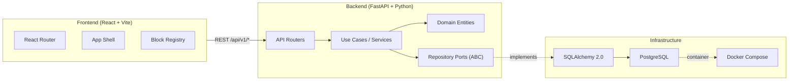
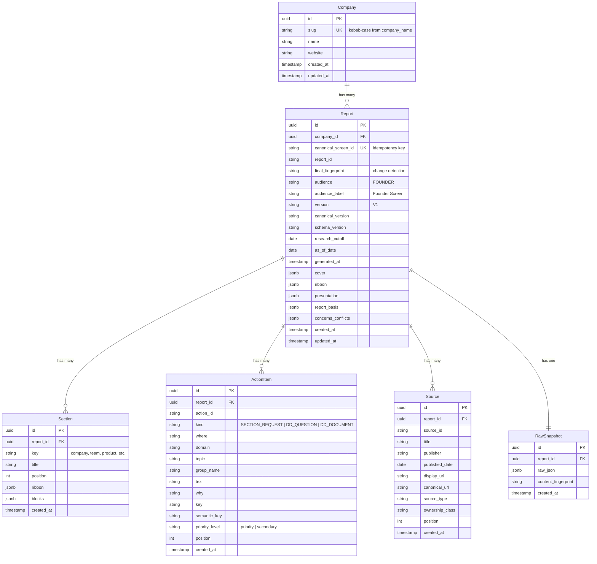

# vSET Startup Screening Dashboard — Implementation Plan (Revised)

> **Phase 1 deliverable — Python backend revision. Awaiting approval.**

---

## 1. Architecture Overview



### Stack

| Layer | Technology |
|---|---|
| **Backend framework** | FastAPI (async, automatic OpenAPI/Swagger) |
| **Validation & DTOs** | Pydantic v2 |
| **ORM** | SQLAlchemy 2.0 (async engine) |
| **Migrations** | Alembic |
| **Database** | PostgreSQL 16 (Docker Compose) |
| **Testing** | pytest + pytest-asyncio + httpx (async test client) |
| **Frontend** | React + TypeScript + Vite + Tailwind CSS *(unchanged)* |

### Clean Architecture Layers

| Layer | Depends on | Contains |
|---|---|---|
| **Domain** | Nothing | Dataclasses, value objects, types |
| **Application** | Domain | Services (use cases), port ABCs, mappers |
| **Infrastructure** | Application, Domain | SQLAlchemy models, repo implementations, ingestion |
| **Presentation** | Application, Domain | FastAPI routers, Pydantic response schemas |

> [!IMPORTANT]
> Dependencies point **inward only**. Domain has zero framework imports. Infrastructure implements abstract port classes defined in Application. FastAPI's `Depends()` handles dependency injection.

---

## 2. Data Model

*(Unchanged from the original plan — same tables, same relationships.)*



---

## 3. API Contract

*(Unchanged — same 7 endpoints, same response shapes.)*

| Method | Path | Purpose |
|---|---|---|
| `GET` | `/api/v1/companies` | List all companies |
| `GET` | `/api/v1/companies/{slug}` | Report header (cover, ribbon, audience) |
| `GET` | `/api/v1/companies/{slug}/sections` | Section navigation (key, title, position) |
| `GET` | `/api/v1/companies/{slug}/sections/{key}` | Full section (ribbon, blocks, info to prepare) |
| `GET` | `/api/v1/companies/{slug}/actions` | Tab 8: questions + documents |
| `GET` | `/api/v1/companies/{slug}/sources` | Tab 9: about text + source list |
| `POST` | `/api/v1/reports/import` | Import raw JSON (API-key guarded) |

FastAPI auto-generates **OpenAPI/Swagger** at `/docs` and `/redoc` from the Pydantic response models.

---

## 4. Backend Folder Structure

```
backend/
  app/
    domain/                         # Pure Python — no framework imports
      entities/
        __init__.py
        company.py                  # @dataclass Company
        report.py                   # @dataclass Report
        section.py                  # @dataclass Section
        block_types.py              # Block type literals, type aliases
        action_item.py              # @dataclass ActionItem
        source.py                   # @dataclass Source
    application/                    # Use cases & ports
      ports/
        __init__.py
        company_repository.py       # ABC
        report_repository.py        # ABC
        section_repository.py       # ABC
        action_item_repository.py   # ABC
        source_repository.py        # ABC
      services/
        __init__.py
        list_companies.py
        get_report_header.py
        get_section_nav.py
        get_section.py
        get_actions.py
        get_sources.py
        import_report.py
      mappers/
        __init__.py
        cover_mapper.py
        section_mapper.py
        action_mapper.py
        source_mapper.py
        report_meta_mapper.py
    infrastructure/
      persistence/
        __init__.py
        database.py                 # async engine, session factory
        models.py                   # SQLAlchemy ORM models
        company_repo.py             # implements CompanyRepository
        report_repo.py
        section_repo.py
        action_item_repo.py
        source_repo.py
      ingestion/
        __init__.py
        schema_validator.py         # Pydantic model for raw JSON validation
        version_gate.py             # Rejects unsupported versions
        import_service.py           # Orchestrates import
    presentation/
      __init__.py
      dependencies.py              # FastAPI Depends() providers
      routers/
        __init__.py
        companies.py
        sections.py
        actions.py
        sources.py
        import_router.py
      schemas/                      # Pydantic response/request models
        __init__.py
        company_schemas.py
        section_schemas.py
        action_schemas.py
        source_schemas.py
        import_schemas.py
      guards/
        api_key_guard.py
      error_handlers.py
    config.py                       # Settings from env vars (pydantic-settings)
    main.py                         # FastAPI app, CORS, middleware, routers
  alembic/
    env.py
    versions/
  alembic.ini
  seed.py                           # Imports both reference JSONs
  tests/
    __init__.py
    conftest.py                     # Fixtures: test DB, test client, seed data
    unit/
      test_mappers.py
      test_version_gate.py
      test_schema_validator.py
    integration/
      test_import_idempotency.py
      test_api_companies.py
      test_api_sections.py
      test_api_actions.py
      test_api_sources.py
      test_contract_third_company.py
  docker-compose.yml
  pyproject.toml                    # Dependencies, pytest config, ruff/black
  .env.example
  README.md
```

---

## 5. Frontend Folder Structure

*(Unchanged from the original plan — React + TypeScript + Vite + Tailwind.)*

```
frontend/
  src/
    app/
      providers.tsx
      router.tsx
      layout/
        AppShell.tsx
    core/
      http-client.ts
      env.ts
      query-client.ts
    shared/
      ui/   Button, Chip, Card, Callout, DataTable, KeyValueGrid,
            Skeleton, EmptyState, ErrorState, FounderCard, etc.
      lib/  formatting utilities
      styles/
        tokens.css
        global.css
    features/
      companies/
        api.ts, hooks.ts, CompanySwitcher.tsx
      report/
        domain/types.ts
        data/api.ts, hooks.ts
        ui/
          shell/  Sidebar, TopBar, ReportHeader
          blocks/ registry.ts + 7 block components + UnknownBlock
          sections/ SectionPage.tsx
          actions/  ActionsPage, ConcernsSection, QuestionsSection, DocumentsSection
          sources/  SourcesPage
    config/
      callout-titles.ts
    routes/
  tests/
  vite.config.ts, tailwind.config.ts, tsconfig.json, vitest.config.ts
```

---

## 6. Key Python Implementation Details

### Dependency Injection (via FastAPI `Depends`)

```python
# presentation/dependencies.py
from fastapi import Depends
from sqlalchemy.ext.asyncio import AsyncSession

async def get_db() -> AsyncGenerator[AsyncSession, None]:
    async with async_session_factory() as session:
        yield session

def get_company_repo(db: AsyncSession = Depends(get_db)) -> CompanyRepository:
    return SqlAlchemyCompanyRepo(db)

def get_list_companies(repo: CompanyRepository = Depends(get_company_repo)) -> ListCompaniesService:
    return ListCompaniesService(repo)
```

### Domain Entities (pure dataclasses)

```python
# domain/entities/company.py
from dataclasses import dataclass
from uuid import UUID
from datetime import datetime

@dataclass(frozen=True)
class Company:
    id: UUID
    slug: str
    name: str
    website: str
    created_at: datetime
    updated_at: datetime
```

### Repository Ports (abstract base classes)

```python
# application/ports/company_repository.py
from abc import ABC, abstractmethod

class CompanyRepository(ABC):
    @abstractmethod
    async def find_all(self) -> list[Company]: ...

    @abstractmethod
    async def find_by_slug(self, slug: str) -> Company | None: ...
```

### Import Idempotency

```python
# Check canonical_screen_id → if exists, compare final_fingerprint
# Same fingerprint → skip (return "unchanged")
# Different fingerprint → update all structured data + new snapshot (return "updated")
# Not found → create everything (return "created")
```

---

## 7. Build Phases

### Phase 2 — Backend Foundation
- Project setup: `pyproject.toml`, virtual env, dependencies
- Docker Compose for PostgreSQL
- SQLAlchemy models + Alembic migration
- Domain entities (pure dataclasses, no framework deps)
- Application mappers (raw JSON → domain)
- Ingestion: Pydantic schema validation, version gate, import service
- Seed script importing both reference JSONs
- Unit tests for mappers and importer (including idempotency)

### Phase 3 — API
- Services (use cases): ListCompanies, GetReportHeader, GetSectionNav, GetSection, GetActions, GetSources
- FastAPI routers, Pydantic response schemas
- API key guard for import endpoint
- CORS from env, structured logging
- OpenAPI docs (automatic from FastAPI)
- Integration tests: import both JSONs → assert all 9 tabs per company
- Contract test: fake 3rd company JSON → zero code changes

### Phase 4 — Frontend Foundation *(unchanged)*
### Phase 5 — Report Views *(unchanged)*
### Phase 6 — Polish & Verification *(unchanged)*

---

## 8. Dependencies (`pyproject.toml`)

```toml
[project]
requires-python = ">=3.12"

dependencies = [
    "fastapi>=0.115",
    "uvicorn[standard]>=0.32",
    "pydantic>=2.9",
    "pydantic-settings>=2.6",
    "sqlalchemy[asyncio]>=2.0",
    "asyncpg>=0.30",
    "alembic>=1.14",
    "python-dotenv>=1.0",
]

[project.optional-dependencies]
dev = [
    "pytest>=8.3",
    "pytest-asyncio>=0.24",
    "httpx>=0.28",
    "ruff>=0.8",
    "black>=24.10",
]
```

---

## 9. Confirmed Decisions *(all carry forward)*

| Decision | Choice |
|---|---|
| Backend stack | **FastAPI + SQLAlchemy + Pydantic** (changed from NestJS) |
| Python version | 3.13 (available on system via `py -3.13`) |
| Reference files | `./reference/` |
| Table column widths | Use them |
| `body_gate`, `adaptations` | Stored in raw snapshot only |
| `comparison.mode` | Stored, not used for rendering |
| Database | PostgreSQL via Docker Compose |
| Company slug | Kebab-case from `company_name` |
| Blocks storage | JSONB in Section table |
| Frontend | React + TypeScript + Vite + Tailwind *(unchanged)* |

---

> [!NOTE]
> **Waiting for your approval** before proceeding to Phase 2 (Backend Foundation with Python). If anything needs adjustment, let me know.
